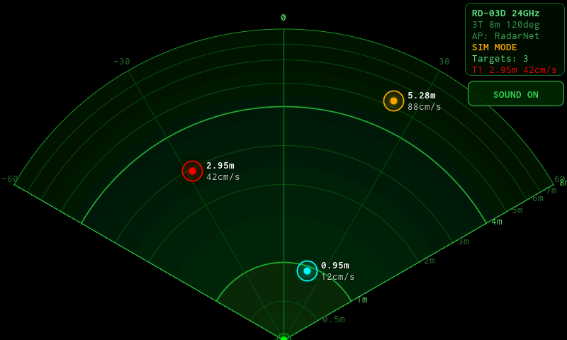
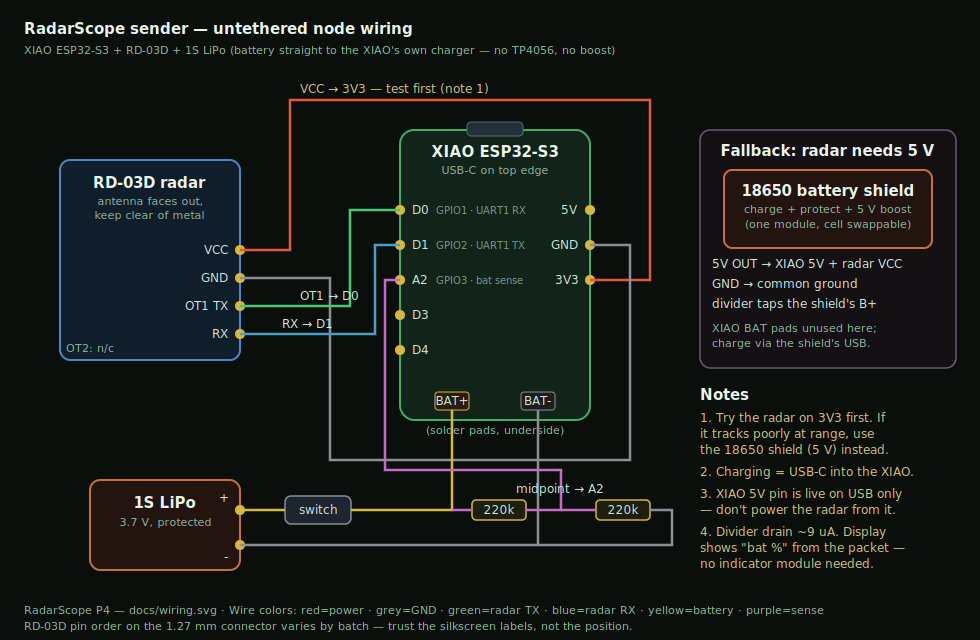

# RadarScope P4 — mmWave motion radar display

Port of [Stevee87/Arduino-ESP32-Radarproject](https://github.com/Stevee87/Arduino-ESP32-Radarproject)'s
Arduino GIGA receiver to the **ELECROW CrowPanel Advance 5.0" ESP32-P4**
(800×480 IPS RGB, GT911 touch, ESP32-C6 Wi-Fi over SDIO) — with thanks to
Stevee87 for the original design (see [Credits](#credits--thanks)).



The radar node is a XIAO ESP32-S3 + Ai-Thinker RD-03D 24 GHz radar. It joins
the `RadarNet` AP this unit hosts and streams UDP packets to port 4210; this
display draws up to 3 tracked targets on a 120°/8 m scope with
distance-reactive sonar pings on the onboard speaker.

Two sender options, both compatible:
- **`sender/` in this repo (recommended)** — simplified untethered build:
  LiPo straight to the XIAO's built-in charger (no TP4056, no boost, no
  indicator module), battery telemetry in the packet (shown as `bat %` on the
  display), Wi-Fi modem sleep, 5 Hz send rate. Wiring: see below.
- The stock upstream
  [`rd03d_xiao_s3_transmitter`](https://github.com/Stevee87/Arduino-ESP32-Radarproject/tree/main/Firmware)
  sketch — works unmodified (no battery readout).

## Sender wiring



Parts: XIAO ESP32-S3, RD-03D, 1S LiPo (protected), slide switch, two 220 k
resistors. Radar `OT1→D0`, `RX→D1`, `VCC→3V3` (**test 3.3 V first** — if
tracking is unreliable at range, use an 18650 battery-shield module and feed
5 V instead), battery to the BAT pads through the switch, and a 220k/220k
divider from BAT+ to `A2` for the battery readout. Charge via the XIAO's
USB-C. Build the sender with:

```bash
arduino-cli compile --fqbn "esp32:esp32:XIAO_ESP32S3" sender
arduino-cli upload  --fqbn "esp32:esp32:XIAO_ESP32S3" -p /dev/cu.usbmodem* sender
```

**Packet format:** the first 32 bytes are byte-identical to upstream
(magic `0xD03DA7A`, frame counter, 3 × {x, y, speed, valid}); this repo's
sender appends `{batMv:u16, batPct:u8, version:u8}`. Receivers that don't
know the tail ignore it, and this display falls back gracefully when it's
absent — so any sender/display pairing works.

## Status

- **Compiles clean** for the P4 (`arduino-cli`, core 3.3.10). Not yet run on
  hardware.
- Renderer verified on the host (`tools/preview.cpp` renders the real compose
  path to a PPM — layout matches the GIGA original).
- **Polish pass done** (still no LVGL): the background is an analytic per-pixel
  render — coverage-based AA for the fan, ring bands, and spokes (no stipple),
  with a radial gradient. Targets are AA glow/ring/core markers, panels and the
  button are rounded translucent shells, and all text uses baked anti-aliased
  **Inconsolata** (OFL) glyph cells (`font_aa.h`, ~55 KB flash; regenerate with
  `tools/gen_font.py`, needs Pillow). The analytic background costs a few
  hundred ms once at boot; the per-frame path is unchanged (memcpy + overlays).
- **SIM MODE** is built in: until a sender is heard (and again if it goes
  quiet for 30 s), two synthetic walkers roam the scope, so display, touch,
  and audio can be verified before the RD-03D arrives. The info box shows an
  amber `SIM MODE` badge; the first real packet switches it off.

## What changed vs the GIGA build

| | GIGA original | This port |
|---|---|---|
| Rendering | incremental erase/redraw + 10 s full repaint | full-frame recompose from a pre-rendered background (two 768 KB PSRAM buffers) |
| Sound | passive piezo on pin 9 (`tone()`) | onboard speaker, raw I2S 16 kHz sine pings (`pinger.cpp`); same distance→tempo/pitch curve |
| Touch | GIGA shield, portrait-raw coords rotated in code | GT911 via ESP32_Display_Panel, native 800×480 coords |
| Mute button | "BUZZER AN"/"STUMM" | "SOUND ON"/"MUTED", rounded AA button top-right |
| Wi-Fi | GIGA hosts AP natively | ESP32-C6 over SDIO (esp-hosted), `WiFi.setPins()` then `softAP()` |

Scope geometry, range scale, ghost filter (2 s no-motion hide), packet format
(magic `0xD03DA7A`, 32-byte packed struct), SSID/password/port are all
verbatim from upstream — the stock sender needs zero changes.

## Build

Libraries (Arduino Library Manager): **ESP32_Display_Panel 1.0.4** (+ its deps
ESP32_IO_Expander, esp-lib-utils). ESP32 Arduino core ≥ 3.3 (tested 3.3.10).
No LVGL, no ArduinoJson.

```bash
FQBN="esp32:esp32:esp32p4:PSRAM=enabled,FlashSize=16M,PartitionScheme=huge_app,USBMode=default,CDCOnBoot=cdc"
arduino-cli compile --fqbn "$FQBN" .
arduino-cli upload  --fqbn "$FQBN" -p /dev/cu.wchusbserial* .
```

Flashing (CrowPanel Advance): **hold BOOT, tap RESET** to get the ROM port on
the UART0 USB-C (CH340-family bridge — on macOS install the WCH CH34x VCP
driver; the port shows up as `/dev/cu.wchusbserial*`). Full power-cycle after
flashing if the C6 radio acts wedged. If you build multiple ESP32 targets on
one machine, **recompile immediately before upload** — a shared build cache
can silently flash the wrong chip's image.

Host preview:
```bash
cd tools && c++ -std=c++17 -O2 -I.. preview.cpp ../radar_ui.cpp ../gfx.cpp -o /tmp/radar_prev
/tmp/radar_prev /tmp/preview.ppm
```

## Board facts (CrowPanel Advance 5.0" V1.0, from ELECROW's lessons)

- Panel: 800×480 **RGB ST7262** (parallel RGB, not MIPI-DSI) — timings/pins
  in `board_config.h`, consumed by `esp_panel_board_custom_conf.h`
  (ELECROW Lesson07, verbatim).
- Touch: GT911 — I2C SCL 46 / SDA 45, RST 36, INT 42.
- **STC8H1KXX helper MCU** at I2C `0x2F` owns backlight PWM
  (`stc8_set_pwm_duty`), amp shutdown (`STC8_GPIO_OUT_AUDIO_SD`, **active
  LOW = on**), battery, TP/CSI resets — `bsp_stc8h1kxx.c` + `bsp_i2c.c`
  copied from Lesson12. Init order matters: `i2c_init()` → backlight 0 →
  `Board::init()/begin()` (conf has `SKIP_INIT_HOST=1`) → backlight 100.
- C6 Wi-Fi SDIO: CLK 53 / CMD 54 / D0 52 / D1 51 / D2 50 / D3 49, reset 20.
- Speaker: raw I2S BCLK 22 / LRCLK 21 / DOUT 23, no codec (software gain in
  `pinger.cpp`, `kGain`).

## First-boot checklist

1. Splash renders → RGB panel timings good.
2. `AP: RadarNet <ip>` on splash → C6/esp-hosted link good.
3. SIM MODE walkers move smoothly → compose/present path good.
4. Tap SOUND ON/MUTED → GT911 good.
5. Pings that speed up as a (simulated) target closes → I2S + amp good.
6. Flash the stock XIAO sender, power it → `SIM MODE` badge swaps to
   `RX: OK fr:N` when packets arrive.

## Troubleshooting

- **Black screen, serial alive** → STC8 backlight write failed; check I2C
  init order, and that nothing re-initialized the bus.
- **Colors wrong / channels swapped** → RGB565 byte order; try swapping bytes
  in `present()` or check `ESP_PANEL_BOARD_LCD_RGB_PIXEL_BITS`.
- **Wi-Fi never comes up** → ELECROW has remapped wireless-adjacent pins
  between revisions in this board series; if yours is a later rev than V1.0,
  check the SDIO pins in `board_config.h` against the wiki for your rev.
- **Image shivers/tears** → RGB-scanout boards sometimes need an
  internal-SRAM bounce buffer; if the P4 shows this, look at
  `configRGB_BounceBufferSize` in the panel conf.
- **No sound** → amp enable is via STC8 I2C (active LOW), volume is `kGain`
  in `pinger.cpp`; speaker must be on its header.

## Credits & thanks

This project is a port of
[**Stevee87/Arduino-ESP32-Radarproject**](https://github.com/Stevee87/Arduino-ESP32-Radarproject)
— the radar protocol, the scope design, the target tracking/clustering, and
the whole two-node concept are Stevee87's work (MIT). Many thanks for building
it and sharing it; this repo only re-homes the display onto different hardware
and adds trimmings on top of that foundation.

Also credited:
- Board support (`esp_panel_board_custom_conf.h`, `esp_panel_drivers_conf.h`,
  `bsp_i2c.*`, `bsp_stc8h1kxx.*`): from
  [ELECROW's examples](https://github.com/Elecrow-RD/-CrowPanel-Advanced-5inch-ESP32-P4-HMI-AI-Display-800x480-IPS-Touch-Screen)
  for this display.
- `font_aa.h` is baked from **Inconsolata** (SIL Open Font License 1.1) by
  `tools/gen_font.py`.
- Everything else: MIT (see `LICENSE`).
